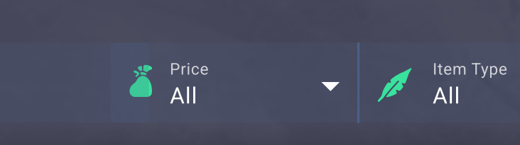

# ChicksGold FE Challenge

Proyecto base creado con [aurelia/new](https://github.com/aurelia/new).

## Cómo ejecutar el proyecto

Puedes usar cualquiera de estos gestores de paquetes:

- Yarn: `yarn start`

Esto levanta el servidor de desarrollo (Vite) con Hot Module Reload (HMR).

## Estructura relevante

- `src/`
    - `my-app.*`: Shell de la app y rutas (Home, Cart). Incluye notificaciones (toasts).
    - `components/`
        - `header/`: Header responsive (logo, categorías, moneda, carrito, menú móvil/drawer).
        - `toolbar/`: Filtros (juego, búsqueda, precio, tipo). En móvil, panel “Filters” (overlay/bottom sheet).
        - `product/`: Listado y tarjeta de producto (precio con descuento, cantidad, botón ADD, etc.).
        - `pagination/`: Paginación simple.
        - `payment-methods/`: Tira de logos de medios de pago (responsive, con wrap y tamaños por breakpoint).
        - `toast/`: Sistema de notificaciones “Added to cart”.
        - `footer/`: Footer responsive (social, columnas de enlaces, Trustpilot).
    - `services/`
        - `cart-service.ts`: Carrito (add/remove/clear), eventos (`cart:changed`, `cart:added`) y persistencia en `localStorage`.
    - `pages/`: Vistas de `home/` y `cart/`.
    - `styles/main.css`: Estilos globales (layout, contenedores, utilidades y ajustes responsivos).
    - `assets/`: Imágenes, íconos y logos usados por la UI.
    - `public/`: Assets que simulan venir del backend (por ejemplo imágenes de productos) y que deben servirse estáticamente.

## Flujo y funcionalidades clave

- Catálogo y filtros:
    - Filtro por juego (ID), búsqueda por texto (título/descr.), y filtros de precio/tipo.
    - En escritorio, controles inline en la barra; en móvil, botón “Filters” abre panel inferior (overlay) con selección y estados marcados.

- Tarjeta de producto:
    - Muestra precio con descuento y precio original tachado.
    - Control de cantidad horizontal (sin spinners nativos) y botón “ADD” con ícono.
    - Publica evento `cart:added` al agregar para disparar un toast.

- Carrito (CartService):
    - API mínima: `add(item, qty)`, `remove(id)`, `clear()`.
    - Persistencia en `localStorage` para mantener el estado entre navegaciones/recargas.
    - Emite `cart:changed` (contador en header) y `cart:added` (toast).

- Navegación SPA:
    - El logo y el icono de carrito usan navegación de Aurelia (sin recarga completa) para preservar estado.

- Notificaciones (toasts):
    - Implementadas con CSS/TS sin librerías externas. Aparecen en la esquina (o abajo en móvil), con auto-dismiss.

- Responsividad (highlights):
    - Header: menú móvil tipo drawer con overlay; el texto “Cart” se oculta en móvil, el ícono queda visible.
    - Toolbar: panel “Filters” en móvil; z-index ajustados para evitar problemas de stacking.
    - Categorías: gaps y paddings escalados con `clamp()`; la lista puede encogerse para no tapar acciones.
    - Payment methods: fila de logos con `flex-wrap`, tamaños fluidos en móvil y tamaños de diseño en desktop.
    - Footer: columnas reflow según ancho, Trustpilot sin overflow en anchos medios, logo dimensionado por breakpoint.

## Datos y supuestos

- Se asume que los datos del servidor son válidos; se realizan validaciones básicas (p.ej., precio/cantidad).
- Se usa `fetch` relativo y JSON fuera de `public/` para simular llamada al API (no acceso directo por URL).
- Algunas imágenes fueron sustituidas por assets de ejemplo.
- en el componente de busqueda se ve en el pdf que hay un overlap con el filtro de precios, por consiguiente no se haran esos dos 'componentes' como uno solo 
- pueden haber varios filtros activos al mismo tiempo

## Cómo probar

- Ejecuta el servidor de desarrollo (ver arriba) y navega a la Home.
- Prueba el filtrado por juego/búsqueda y el panel “Filters” en móvil.
- Agrega productos al carrito y verifica:
    - contador en el header,
    - persistencia al navegar entre paginas como /cart,
    - toast “Added to cart”.

## Notas técnicas

- Aurelia 2 + TypeScript.
- Estilos en CSS puro, con selectores por componente y estilos globales en `styles/main.css`.
- Se usan utilidades modernas de CSS: `flex`, `grid`, `clamp()`, `aspect-ratio`, media queries y transiciones.

## Scripts útiles

- `start`: inicia el servidor de desarrollo.
- `test`: ejecuta pruebas (si están configuradas en el proyecto).

---

Si el revisor necesita profundizar en algún módulo (p. ej., `cart-service.ts`, `toolbar`, o `toast-notifications`), los archivos están comentados y con nombres descriptivos. Este README resume sólo lo esencial para entender arquitectura, ejecución y comportamiento de la app.

